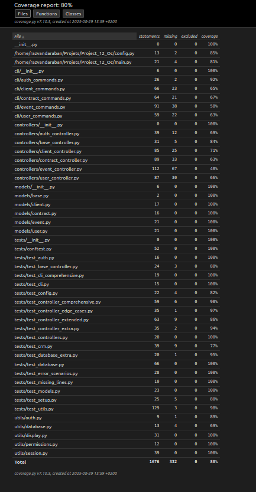

## Project_12_Oc
Développez une architecture back-end sécurisée avec Python et SQL

# <span style="color: #cf80cf;">Epic Events CRM</span>

A command-line CRM system for event management company Epic Events.

## <span style="color: #307a4a;">Setup</span>

1. Create virtual environment: `python -m venv epic_events`
2. Activate virtual environment: `source epic_events/bin/activate`
3. Install dependencies: `pip install -r requirements.txt`
4. Initialize database: `python init_db.py`
5. Seed with test data: `python seed_db.py`

## <span style="color: #cf80cf;">Usage</span

### <span style="color: #307a4a;">Authentication</span>
```bash
python main.py auth
```

## <span style="color: #cf80cf;">Client Management</span

#### <span style="color: #307a4a;">List all clients</span>
python main.py clients list

#### <span style="color: #307a4a;">List my clients (sales only)</span>
python main.py clients list --mine

#### <span style="color: #307a4a;">Create client (sales only)</span>
python main.py clients create

#### <span style="color: #307a4a;">View client details</span>
python main.py clients view <client_id>

#### <span style="color: #307a4a;">Update client</span>
python main.py clients update <client_id> --name "New Name"

#### <span style="color: #307a4a;">Delete client (management only)</span>
python main.py clients delete <client_id>


## <span style="color: #cf80cf;">Contract Management</span>

#### <span style="color: #307a4a;">List contracts</span>
python main.py contracts list

#### <span style="color: #307a4a;">Create contract (management only)</span>
python main.py contracts create --client-id 1 --amount 5000

#### <span style="color: #307a4a;">View contract details</span>
python main.py contracts view <contract_id>

## <span style="color: #cf80cf;">Event Management</span>

#### <span style="color: #307a4a;">List events</span>
python main.py events list

#### <span style="color: #307a4a;">Create event (sales only)</span>
python main.py events create --contract-id 1 --name "Event Name" --start-date "2024-01-01 14:00" --end-date "2024-01-01 18:00" --location "Venue" --attendees 100

#### <span style="color: #307a4a;">Assign support (management only)</span>
python main.py events assign-support <event_id> --support-id 1

## <span style="color: #cf80cf;">User Management</span>

#### <span style="color: #307a4a;">List users</span>
python main.py users list

#### <span style="color: #307a4a;">Create user</span>
python main.py users create

## Testing

The project has comprehensive test coverage exceeding 80%. To run the tests:


# Install test dependencies
pip install pytest coverage

# Run all tests with coverage
coverage run -m pytest tests/ -v

# Generate coverage report
coverage report -m

# Generate HTML report (optional)
coverage html


